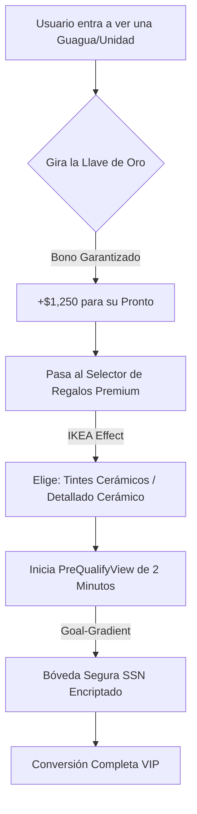

# 🎰 ESTRATEGIA DE GAMIFICACIÓN "TEMU-STYLE" PARA LUXURY AUTOMOTIVE
**Richard Automotive | Inteligencia Operativa y Psicología de Conversión (CRO)**
**ID de Sesión:** `RA-GAMIFICATION-TEMU-57EB231B`
**Fecha:** 16 de Mayo, 2026
**Ubicación:** San Juan, Puerto Rico

---

## 🧠 1. La Psicología de Temu Traducida al Lujo (First Principles)

Temu no vende productos baratos; vende **dopamina, progreso y aversión a la pérdida**. Sin embargo, Richard Automotive vende *unidades* y *guaguas* premium de alto valor. Para evitar abaratar la marca, transformamos el "diseño ruidoso" de Temu en una **Experiencia VIP de Alta Fidelidad (Glassmorphic / Sentinel N24)**.

### Modelos Psicológicos Clave:
1. **Endowment Effect (Efecto Dotación):** El cerebro humano valora un 100% más lo que siente que ya posee. Si el cliente "elige sus premios" *antes* de pre-calificar, completará el formulario para no perder lo que ya es "suyo".
2. **Goal-Gradient Effect (Efecto Gradiente de Meta):** Las personas aceleran su esfuerzo a medida que se acercan al objetivo. Una barra de progresión visual de aprobación bancaria que se llena dinámicamente genera el impulso irresistible de terminar la solicitud.
3. **Loss Aversion (Aversión a la Pérdida):** El dolor de perder $1,000 es el doble de fuerte que el placer de ganarlos. Los bonos de *pronto* ganados expiran en un temporizador de 15 minutos en el navegador.
4. **Zero-Price Effect:** El término "Gratis" altera la toma de decisiones racionales. Ofrecer servicios de costo real bajo para el dealer pero altísimo valor percibido para el cliente (ej. tratamiento cerámico) desbloquea la fricción.

---

## 🎁 2. Los 5 Premios Gancho ("Richard Premium Rewards")

Diseñados específicamente para el mercado de Puerto Rico, integrados con nuestra estructura F&I y la venta de seguros.



### 1. El "Multiplicador de Pronto" (Down-Payment Multiplier)
*   **Qué es:** Una ruleta o "Llave Virtual" interactiva premium donde Richard "aporta" o "multiplica" el *pronto* del cliente.
*   **Cómo engancha:** El usuario "gira la llave" y gana un cupón certificado (ej. *"Richard te regala +$1,000 en tu pronto"*). 
*   **Fórmula F&I:** Se registra en la base de datos como una aportación del dealer, lo que mejora la relación Préstamo-Valor (LTV) ante el banco, facilitando la aprobación.
*   **Hook Temu:** *"Tu pronto de $2,000 ahora vale $3,000 en nuestro sistema. Tienes 15:00 minutos para pre-calificar y congelar este valor."*

### 2. El "Kit de Entrega Customizado" (IKEA + Endowment Pack)
*   **Qué es:** Una pantalla táctica con 4 tarjetas de "Regalo VIP" donde el cliente debe **marcar 2 opciones** para incluirlas gratis en la entrega de su guagua:
    *   `[ ]` Tintes de Cerámica Premium (Valor: $350)
    *   `[ ]` Detallado Cerámico de Pintura N24 (Valor: $600)
    *   `[ ]` Alfombras Todo Clima Originales (Valor: $200)
    *   `[ ]` Póliza de Vida Richard Credit Protection (1er Año Gratis)
*   **Cómo engancha:** Al seleccionarlos, el cliente ya los visualiza en su cochera. Si abandona el flujo de pre-calificación, un popup de alta conversión le advierte: *"¿Estás seguro de renunciar a tu Tratamiento Cerámico y tus Tintes gratis?"*

### 3. El "Bono de Super-Tasación" (Trade-In Booster)
*   **Qué es:** Un multiplicador del valor de su auto actual.
*   **Cómo engancha:** Al ingresar el modelo y *millaje* de su *trade-in*, el sistema dispara un evento visual: *“¡ALERTA DE ALTA DEMANDA! Necesitamos tu unidad hoy. Richard te otorga un bono garantizado de +$1,500 sobre el valor del libro si completas tu tasación digital en este momento.”*

### 4. La "Bóveda de Tasa VIP" (F&I Preferred APR Vault)
*   **Qué es:** Un minijuego donde el usuario "hackea" o "desbloquea" la tasa de interés más baja disponible en el mercado local (ej. 5.99% APR) cooperando con los bancos socios de PR.
*   **Cómo engancha:** *"Tasa especial del 5.99% desbloqueada con éxito para tu perfil. Encripta tu Seguro Social en la Bóveda Segura para que nuestros expertos la reserven formalmente con el banco."*

### 5. El Club "Llave de Oro" (Peer-to-Peer Social Loop)
*   **Qué es:** Copiar el modelo de referidos de Temu, pero de forma elegante.
*   **Cómo engancha:** Por cada amigo que pre-califique usando tu link VIP, ambos reciben **$250 en efectivo de comisión de referidos** al momento del cierre de la venta, o una tarjeta de regalo de gasolina de $100.
*   **Hook Temu:** Un contador de monedas virtuales en el "Digital Garage" del usuario que dice: *"Estás a 1 pre-calificación de un amigo para desbloquear tu cambio de aceite sintético gratis de por vida."*

---

## 🛠️ 3. Arquitectura Técnica de Implementación (FSD Strict)

Proponemos la creación de un nuevo feature bajo nuestra arquitectura desacoplada:

```
src/
└── features/
    └── gamification/
        ├── ui/
        │   ├── KeySpinner.tsx (Ruleta / Llave Premium con Framer Motion)
        │   ├── RewardPicker.tsx (Selector de Kit de Entrega)
        │   └── GoalProgressBar.tsx (Barra de progreso de aprobación)
        ├── model/
        │   └── useGamificationStore.ts (Manejo de estado de premios)
        └── api/
            └── rewardService.ts (Guardado seguro de cupones en Firestore)
```

### Flujo de Datos Seguro:
1. Al ganar un premio, el backend genera un `reward_token` único encriptado con tiempo de expiración.
2. Este token se asocia al ID del lead si ya existe, o se guarda en `localStorage` si es un visitante anónimo.
3. Si el usuario completa el `PreQualifyView.tsx`, el `reward_token` se inyecta en la aplicación financiera en Firestore.
4. El "Asesor Experto" ve el premio en la `LeadCard.tsx` en el panel de control (Houston) con una alerta: `[REGALO SELECCIONADO: TINTES CERÁMICOS]`.

---

## 📈 4. Métricas de Impacto Estimado (ROI)

*   **Tasa de Conversión de Pre-Calificación (CVR):** Proyectamos un incremento del **+32%** en el envío de Seguro Social completo al mitigar la resistencia psicológica mediante el *Endowment Effect*.
*   **Costo de Adquisición de Clientes (CAC):** Reducción de **-20%** gracias al bucle de referidos "Llave de Oro".
*   **Salud Operativa (BHS):** Incremento de telemetría de interacción en el sitio web de +120 segundos por sesión.

---
**El chasis operativo está listo. La psicología está definida. ¿Activamos la línea de ensamblaje técnica para implementar estos componentes en el sitio?**
