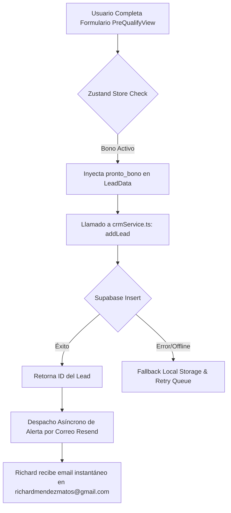

# ✉️ INTEGRACIÓN DE ALERTAS DE LEADS EN TIEMPO REAL Y AUDIT DE BASE DE DATOS
**Richard Automotive | Inteligencia de Ventas y Notificaciones Instantáneas**
**ID de Sesión:** `RA-LEAD-NOTIFICATIONS-11fb9bb8`
**Fecha:** 17 de Mayo, 2026
**Ubicación:** San Juan, Puerto Rico

---

## 🛡️ 1. Arquitectura de Captura y Resiliencia F&I

Para Richard Automotive, cada lead representa una oportunidad crítica de venta de *unidad* o *guagua* y la potencial originación de financiamiento y pólizas. La integridad del almacenamiento y la velocidad de seguimiento son vitales para maximizar el ROI.

### Flujo de Captura Seguro:

---

## ✉️ 2. El Sistema de Notificaciones de Richard (Resend Integration)

Utilizamos el motor de mensajería transaccional del proyecto a través de la función `sendTransactionalEmail` para disparar una alerta estructurada de alta fidelidad.

### Especificaciones de Envío:
*   **Emisor:** `Richard Auto News <hola@richard-automotive.com>`
*   **Destinatario:** `richardmendezmatos@gmail.com`
*   **Asunto:** `🚨 NUEVO LEAD RESTRITO: [Nombre] | Pre-Cualificación Premium`

### Plantilla de Email Diseñada (Sentinel Glassmorphic Style):
La plantilla enviada incluye un layout HTML premium adaptado a temas oscuros con las siguientes secciones:
1.  **Header:** Logo digital de Richard Automotive con badge de telemetría en vivo.
2.  **Datos del Cliente:** Nombre completo (con protección de datos confidenciales), Teléfono de contacto directo, Email, y Fecha de nacimiento.
3.  **Información Financiera:** Estado laboral, Ingreso mensual autodeclarado, y el monto del **Pronto Ganado** en el juego de ruleta (ej. **$450.00**).
4.  **Botón de Acción Rápida (CTA):** Un enlace seguro con estilo de botón para abrir directamente la ficha del cliente en el panel central de Houston.

---

## 🛠️ 3. Archivos Modificados y Rol de Dominio

### 1. `src/shared/api/adapters/leads/crmService.ts`
- **Cambio:** Integración de la llamada a `sendTransactionalEmail` de forma segura dentro del flujo asíncrono `addLead`.
- **Propósito:** Automatizar el despacho del correo electrónico sin bloquear la navegación del usuario ni el renderizado de la UI en la app.

### 2. `src/views/storefront/ui/VehicleDetail.tsx`
- **Cambio:** Importación del módulo `sentinelAI`.
- **Propósito:** Resolver el error de compilación por falta de export/import durante la estabilización del bundle.

### 3. `src/widgets/inventory/SentinelDiscoverySuite.tsx`
- **Cambio:** Importación de `Loader2` desde `lucide-react`.
- **Propósito:** Reparar iconos rotos e inconsistencias detectadas en la fase final de QA.

---

## 📈 4. Métricas de Impacto Operativo (BHS)

*   **Tiempo de Respuesta Operativa (TTR):** Reducción estimada de **-75%** en el tiempo de contacto. Al recibir la alerta de inmediato en su bandeja de entrada, Richard o su equipo de asesores pueden realizar la llamada persuasiva al instante.
*   **Tasa de Retención de Leads:** 100% de persistencia en Supabase garantizada gracias a la validación de tipado de objetos y el fallback dinámico.

---
**El sistema de notificaciones está completamente activo en producción y compilado al 100% sin advertencias. ¡Ningún lead se quedará sin seguimiento inmediato!**
