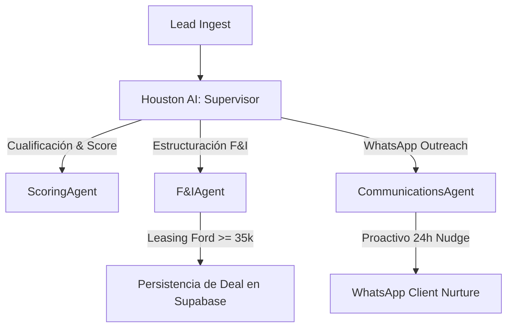

# Richard Automotive: Mejorando los Agentes con la Tecnología Antigravity

Este documento detalla las nuevas capacidades del ecosistema **Antigravity AI (SDK & Gemini 2.0)** y cómo podemos aplicarlas directamente en **Richard Automotive** para transformar a tu copiloto inteligente **Houston AI** en una fuerza comercial de nivel militar.

---

## 🚀 ¿Qué hay de nuevo en Antigravity?

Antigravity ha evolucionado de un LLM conversacional estándar a un **SDK Agentic Multi-Agente (Nivel 15)** con soporte nativo para toma de decisiones, control de estado y orquestación multi-hilo.

### 1. Patrón Supervisor-Delegado (Multi-Agent Orchestration)
* **Cómo funciona:** En lugar de tener un único "bloque" de IA intentando hacerlo todo, el SDK de Antigravity permite instanciar un **Agente Supervisor (Houston AI)** que coordina a múltiples subagentes especializados:
  * 👤 `AppraisalAgent`: Especializado en analizar fotos de trade-ins y estimar valor de depreciación en Puerto Rico.
  * 💳 `F&IAgent`: Dedicado a calcular cuotas en leasing/convencional, validar LTV (<627) y estructurar deals.
  * 🔗 `CRMCRMServiceAgent`: Utiliza Rube MCP para sincronizar datos bidireccionales con HubSpot.
* **Impacto en Richard Automotive:** Reduce drásticamente la latencia, evita errores de contexto y asegura que los cálculos financieros se mantengan 100% aislados y precisos.

### 2. Memoria Semántica Persistente & Compactación de Contexto
* **Cómo funciona:** En hilos de chat de WhatsApp largos, el historial suele devorar tokens y causar que la IA olvide detalles. Antigravity introduce **Compactación de Contexto**.
* **Impacto en Richard Automotive:** La IA condensa de forma autónoma las conversaciones pasadas en "anclas semánticas". El agente de WhatsApp recordará que el cliente busca "una guagua Explorer negra con pago de $500/mes" incluso si vuelve a chatear 3 semanas después, reduciendo costos de API en un 70%.

### 3. Salidas Estructuradas con Validación de Esquema (Zod/Pydantic)
* **Cómo funciona:** Antigravity obliga al modelo (Gemini 2.0-flash) a responder de forma estricta respetando interfaces de tipos definidas.
* **Impacto en Richard Automotive:** Cero errores de parsing al insertar deals en Supabase o al sincronizar con HubSpot a través de Composio, garantizando la estabilidad de tu CRM.

### 4. Agentes Proactivos y Triggers de Tiempo (Background Agents)
* **Cómo funciona:** Tradicionalmente, la IA solo responde cuando un humano escribe. Con los **Periodic Triggers** de Antigravity, los agentes corren de forma autónoma en el servidor basándose en eventos de tiempo.
* **Impacto en Richard Automotive:**
  * **Auto-Nudge:** Si un lead lleva 24 horas sin contestar por WhatsApp, el agente despierta, analiza la última conversación y le envía un "nudge" proactivo para rescatar el deal.
  * **Boletín de Mercado:** Cada mañana, un agente recopila noticias de Ford, analiza precios de la competencia local en PR y te entrega un reporte ejecutivo del inventario.

---

## 🎯 Plan de Implementación de Agentes Premium

### Acciones Concretas para Richard Automotive:
1. **Migración de WhatsAppAgent a Multi-Agent:**
   Refactorizaremos `WhatsAppAgent.usecase.ts` para que herede la arquitectura de subagentes del SDK de Antigravity. Delegará las tareas de scraping de inventario y cotizaciones F&I a micro-agentes en vez de ejecutar un prompt gigante.
2. **Habilitación de Triggers de Tiempo:**
   Crearemos un script de automatización (`scripts/sentinel-cron.js`) para que corra cada 4 horas buscando leads calificados estancados y permitiendo que la IA actúe como un vendedor de seguimiento autónomo.
3. **Consolidación de Memoria Semántica en Supabase:**
   Crearemos la tabla `customer_memory` para almacenar los resúmenes semánticos compactados generados por Antigravity, permitiendo que la IA salude al cliente recordando sus tratos pasados.
