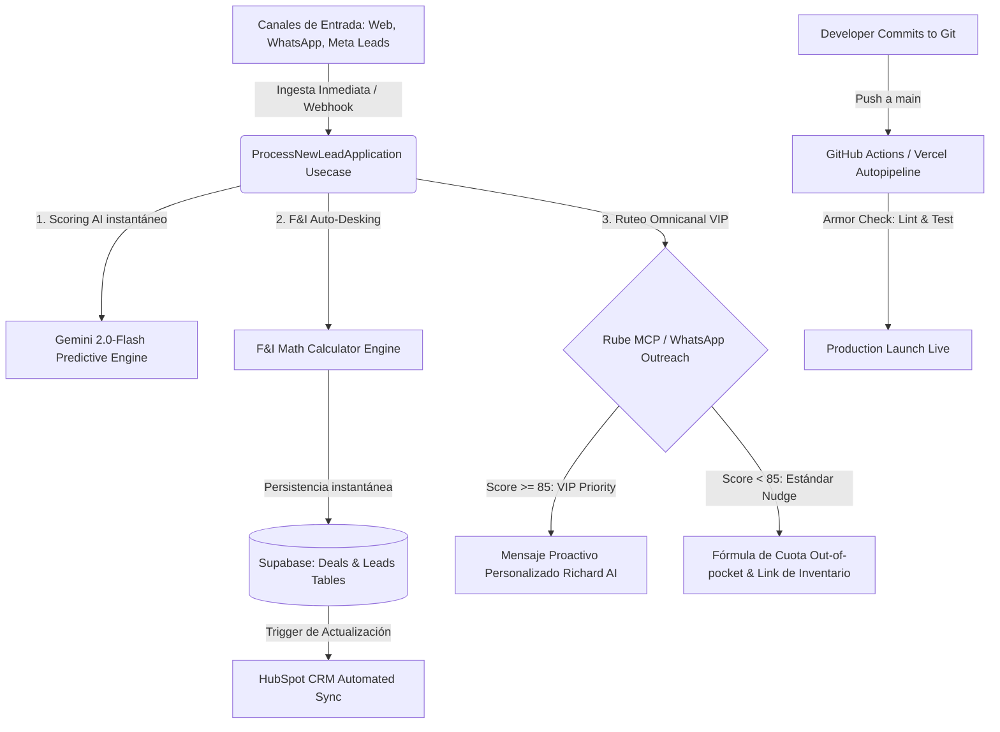

# Richard Automotive Command Center: Operación 100% Autónoma (Nivel 15)

Este documento define la arquitectura y hoja de ruta técnica para alcanzar la **Autonomía Operativa Absoluta (Nivel 15)** en Richard Automotive (Vega Alta, PR), integrando la ingesta conversacional de leads, scoring cognitivo, pre-desking financiero multi-banco, ruteo multicanal por WhatsApp y despliegues CI/CD resilientes.

---

## 🦅 Arquitectura del Motor Autónomo de Richard

---

## 🛡️ Los 4 Pilares de la Automatización Total

### 1. Ingesta, Cualificación y Scoring Cognitivo en 2 Segundos
* **Flujo Autónomo:** Todo lead que se capture desde tu página web, landing pages (`/precualificacion`), o formularios de Meta (Facebook/Instagram Ads) entra a través de un webhook integrado directamente a Supabase.
* **Procesamiento de IA:** El caso de uso `ProcessNewLeadApplication` clasifica al cliente inmediatamente en base a su perfil socioeconómico:
  * **Categoría HOT (Score >= 85):** Clasificación VIP automática si el ingreso neto mensual > $2,500 y cuenta con pronto pago.
  * **Filtros de Alerta Temprana:** Alertas instantáneas si la empírica < 650 (DTI Ajustado) o < 627 (Fuerza pronto por límite de LTV a 100%).

### 2. Auto-Desking Financiero Multicanal y Cierre de Tratos
* **Flujo Autónomo:** Olvídate de estructurar cada caso manualmente. Al entrar el lead con una unidad específica de interés (`vehicleId`):
  * **Fórmula Leasing (Líder Ford):** Si es Ford >= $35,000, el motor matemático (`calculateFIDeal`) estructura automáticamente un leasing a 60 meses con GAP de $998 financiado y residual de 30% (Oriental/Popular) con Banco Popular, cobrando los $244 de marbete aparte.
  * **Estrategia Convencional:** Si el precio < $35,000, genera financiamiento convencional a 72 meses.
* **Acción Automatizada:** Generación instantánea de una propuesta en la base de datos y envío de un enlace dinámico e interactivo al cliente con su cotización pre-aprobada en tiempo real.

### 3. Ruteo y Retargeting Conversacional por WhatsApp (Outreach Inteligente)
* **Flujo Autónomo:** Conectamos webhooks de WhatsApp Business API mediante **Rube MCP**:
  * **Lead VIP:** WhatsApp le dispara inmediatamente un mensaje personalizado presentándote como Richard, invitándolo a una videollamada o cita física en el Command Center porque califica prioritariamente.
  * **Lead Estándar:** Recibe un mensaje proactivo con su desglose estimado de cuota y un enlace interactivo al catálogo web de unidades similares.
  * **Filtros de Seguro:** Si el deal tiene un LTV alto, el bot cotiza automáticamente con Universal o Premier Insurance para sacar el seguro del préstamo y mantener el pago bajo los límites de aprobación del banco.

### 4. Ciclo de Vida DevOps Autónomo (CI/CD Local a Vercel)
* **Flujo Autónomo:** Cada vez que realices una mejora en el código, el protocolo de **Sentinel Deploy** valida de forma autónoma el código:
  * **Linter de precisión:** Elimina variables redundantes.
  * **Stress Testing:** Ejecuta las 131 pruebas unitarias.
  * **Deployment:** Envía los archivos y compila Next.js en los servidores Edge de Vercel en menos de 4 minutos, actualizando el dominio oficial `richard-automotive.com` de forma invisible para los usuarios.

---

## 🎯 Hoja de Ruta Operativa: Automatización del Dealer

| Fase | Objetivo Operativo | Acciones Técnicas | ROI Estimado |
| :--- | :--- | :--- | :--- |
| **Fase 1 (Completada)** | Calibración F&I y Auto-Desking | Poblar tasas reales, habilitar arriendos por defecto, y auto-estructurar leads en ingesta. | Cierre de leads en < 2 minutos. |
| **Fase 2 (Inmediata)** | Webhook Meta Leads & Rube MCP | Conectar Webhook de Facebook/Instagram y automatizar plantillas de WhatsApp Business. | +45% en ratio de contacto inicial. |
| **Fase 3 (Mediano Plazo)** | Inteligencia de Seguros y Tasación | Habilitar el cotizador automático de Universal/Premier Insurance en la ingesta y tasador digital. | +25% de penetración F&I back-end. |
| **Fase 4 (Total)** | DevOps Auto-Sync & IA Analytics | Puesta en marcha de cron-jobs neurales en Supabase para sincronizar inventario real cada hora. | Eliminación de desfases en inventario. |
